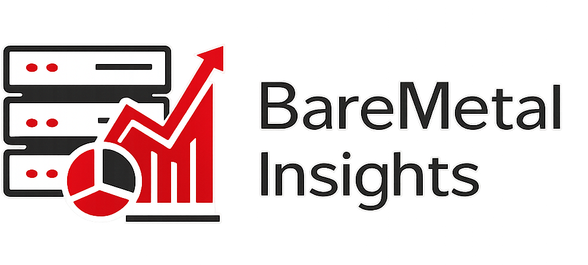

# BareMetal Insights Plugin for OpenShift

<p align="center">
  
</p>

Kubernetes-native visibility for Redfish compatible servers in OpenShift. Discovers bare metal nodes via BareMetalHost CRDs, queries node inventory via Redfish API.

## Overview

- **OpenShift Console integration** - Native UI adds "BareMetal Insights" section
- **Dell Firmware Support** - Supports iDRAC 8 and iDRAC 9 initially

## Prerequisites

- OpenShift 4.19 or later
- Bare metal nodes with BareMetalHost CRDs (Metal3/IPI deployment)
- Redfish compatible servers
- Network access from cluster to Redfish management IPs
- Network access to downloads.dell.com (for Dell firmware catalog)

## Quick Start

### Install via Helm

```bash
# Install from local chart
helm upgrade --install baremetal-insights helm/openshift-baremetal-insights/ \
  --namespace baremetal-insights \
  --create-namespace

# Enable the console plugin
oc patch consoles.operator.openshift.io cluster \
  --patch '{"spec":{"plugins":["baremetal-insights-plugin"]}}' \
  --type=merge
```

### Verify Installation

```bash
# Check pods are running
oc get pods -n baremetal-insights

# Check console plugin is registered
oc get consoleplugins
```

## Configuration

| Parameter | Default | Description |
|-----------|---------|-------------|
| `namespace.name` | `baremetal-insights` | Namespace for deployment |
| `backend.config.pollInterval` | `30m` | How often to scan iDRACs |
| `backend.config.catalogRefresh` | `24h` | How often to fetch Dell catalog |
| `backend.image.tag` | `latest` | Backend image tag |
| `plugin.image.tag` | `latest` | Plugin image tag |
| `metrics.enabled` | `false` | Enable Prometheus ServiceMonitor |

### Example: Custom polling interval

```bash
helm upgrade --install baremetal-insights helm/openshift-baremetal-insights/ \
  --set backend.config.pollInterval=15m \
  --set metrics.enabled=true
```

## Accessing the UI

After installation, navigate to **Compute > Firmware Overview** in the OpenShift Console.

### Views

- **Firmware Overview** - Fleet-wide status dashboard
- **Firmware Nodes** - List of all nodes with firmware status
- **Firmware Node Detail** - Per-node firmware components
- **Firmware Updates** - Available updates grouped by component type

## Architecture

```
┌─────────────────────────────────────────────────────────────┐
│                    OpenShift Console                        │
│  ┌───────────────────────────────────────────────────────┐  │
│  │         Console Plugin (React/PatternFly)             │  │
│  └───────────────────────────────────────────────────────┘  │
└─────────────────────────────────────────────────────────────┘
                              │
                              ▼
┌─────────────────────────────────────────────────────────────┐
│              Backend Service (Go)                           │
│  ┌─────────────┐  ┌─────────────┐  ┌─────────────────────┐  │
│  │ Redfish     │  │ Catalog     │  │ REST API            │  │
│  │ Client      │  │ Service     │  │ /api/v1/*           │  │
│  └─────────────┘  └─────────────┘  └─────────────────────┘  │
└─────────────────────────────────────────────────────────────┘
         │                  │
         ▼                  ▼
┌─────────────────┐  ┌─────────────────┐
│ BareMetalHost   │  │ Dell Catalog    │
│ CRDs + Secrets  │  │ downloads.dell  │
└─────────────────┘  └─────────────────┘
```

## Development

### Build

```bash
# Build Go backend
make build

# Build console plugin
make plugin-build

# Run tests
make test
make plugin-test

# Build container images
make images
```

### Local Development

```bash
# Run backend locally
make run

# Run plugin dev server
cd console-plugin && npm run dev
```

## API Endpoints

| Endpoint | Method | Description |
|----------|--------|-------------|
| `/api/v1/nodes` | GET | List all discovered nodes |
| `/api/v1/nodes/{name}/firmware` | GET | Firmware for specific node |
| `/api/v1/updates` | GET | All available updates |
| `/healthz` | GET | Health check |
| `/metrics` | GET | Prometheus metrics |

## Troubleshooting

### Plugin not appearing in console

1. Check ConsolePlugin is registered: `oc get consoleplugins`
2. Verify plugin is enabled: `oc get consoles.operator.openshift.io cluster -o yaml`
3. Check plugin pod logs: `oc logs -n baremetal-insights -l app.kubernetes.io/component=plugin`

### No nodes discovered

1. Verify BareMetalHost CRDs exist: `oc get baremetalhosts -A`
2. Check backend logs: `oc logs -n baremetal-insights -l app.kubernetes.io/component=backend`
3. Ensure backend has RBAC to read BareMetalHosts

### iDRAC connection failures

1. Verify network connectivity to iDRAC IPs from cluster
2. Check BMC credentials in referenced Secrets
3. Review backend logs for Redfish errors

## License

Apache License 2.0
